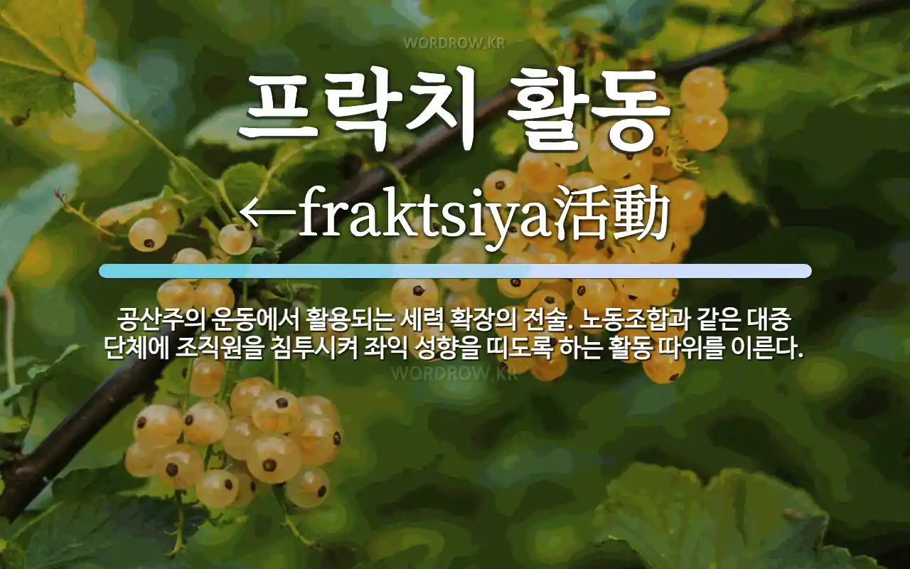
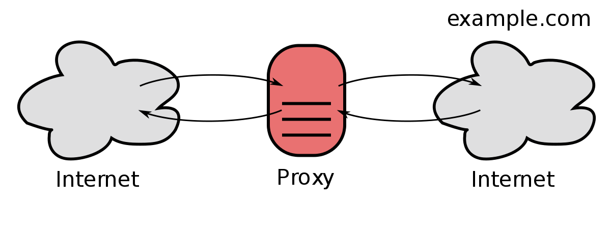

프록시는

가끔 어른들이 "쁘락치" 라는 말을 쓰는 것을 본적이 있는 사람이 있을 것임.

쁘락치는 간첩, 첩자, 저놈은 우리편이 아니라 남의 편인데, 위장하고 들어와서 피해를 준다. 라는 뜻으로 주로 씀

영단어 Proxy 에서 나온 말임.

Proxy 는 대리인, 대행인이라는 뜻인데,

컴퓨터 네트워크에서 쓰일 때에는 "내 기계 대신 통신을 전달하는 어떤 기계" 를 다 프록시라고 부름

나무위키 프록시 문서
https://namu.wiki/w/%ED%94%84%EB%A1%9D%EC%8B%9C%20%EC%84%9C%EB%B2%84

###### 암튼 통신 하는 두 컴퓨터 사이에 껴서 중계해주면 다 프록시라고 부름

암튼 프록시라는 말이 쓰이면 주로 아래와 같은 용도로 쓰임 ㅇㅇ

## 로컬 프록시

로컬 프록시는 프록시가 내 컴퓨터에 있는 거임.

웹 해킹할 때 쓰는 "웹 프록시 툴"이 "로컬 프록시"다.

(웹 프록시 툴의 풀네임은 "웹 로컬 프록시 클라이언트 디버거" 임)

웹 프록시는 브라우저와 연결되어서, 웹서버와 통신할 때 자기 자신을 거쳐서 통신하도록 한다.

##### 웹 프록시 안 쓰고 그냥 쓸 때는 이렇게 접속된다.
브라우저 - 웹서버
##### 웹 프록시 사용하면 이렇게 접속된다.
브라우저 - 웹 프록시 프로그램 - 웹서버

그래서 웹 프록시 프로그램이 브라우저랑 웹서버랑 뭘 주고 받았는지 들여다보거나 편집하는게 가능함

## 프록시 서버

뭐 
"VPN 으로 우회해서 접속한다"
"중국인들이 프록시로 유튜브를 쓴다" 뭐 이런말을 들을 수 있는데,
(중국은 공안 때문에 유튜브나 구글을 쓸 수 없다)

이럴때도 프록시임 ㅇㅇ

쉽게 말해 이런말임

인터넷을 사용 중인 푸바오가 유튜브에 접속하면,
푸바오의 인터넷 브라우저가 www.youtube.com 으로 통신을 요청함

>인터넷 접속 중인 푸바오 - 중국 통신사 - 유튜브 본사 서버

이때, 중국 통신사는 유튜브로 가는 통신이라는 것을 알 수 있으므로 차단한다.
유튜브로 패킷을 안보내고 차단됐음을 알리는 페이지를 보여준다.

>인터넷 접속 중인 푸바오 - 중국 통신사 - 차단되었음을 알리는 페이지

근데 프록시를 거치면 아래와 같이 통신한다.

>인터넷 접속 중인 푸바오 - 중국 통신사 - 프록시 업체 서버 - 유튜브 본사 서버

실제로 유튜브와 직접 통신하는 건 프록시 업체 서버이다. 이런 서버들은 미국이나 슬로바키아같은 제제를 안받는 나라에 서버가 있어서 유튜브에 접속이 됨.

중국 통신사는 슬로바키아 프록시 업체와의 통신은 차단하지 않으니 결론적으로 푸바오가 유튜브를 볼 수 있게 된다.