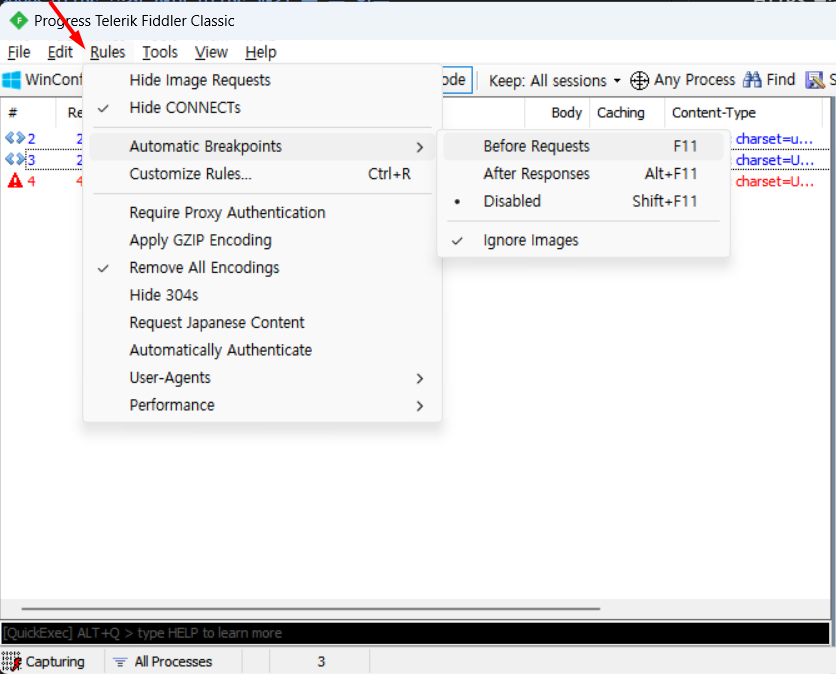

#### HTTPS 설정 해야 HTTPS 패킷 볼 수 있음

- Tools/Options/HTTPS > Decrypt HTTPS traffic 에 체크후 CA 인증서 설치
  ![[Pasted image 20240703090717.png]]

#### 패킷 관련 편의 설정

- Rules/Hide CONNECTs 체크
- Rules/Remove All Encodings 체크

#### Breakpoint 걸기
`https://docs.telerik.com/fiddler-everywhere/modify-and-filter-traffic/breakpoints`

- 아래 탭(status bar)의 3번째 란을 클릭하거나 
- 메뉴탭 : Rules/Automatic Breakpoints/ 선택
- F11, Alt+F11

#### Breakpoint 종류별 차이
  - Before Requests : 브라우저가 요청을 보내면 서버로 보내지 않고 캡쳐
  - After Responses : 서버에서 브라우저에 도달하기 전에 캡쳐(잘 쓸일이 없음)
  - Disable : 패킷을 캡쳐하지 않고 그냥 기록만

