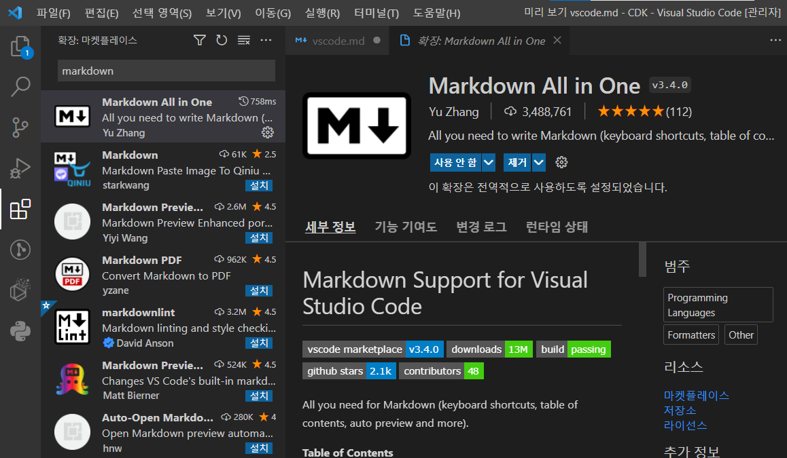

### 마크다운이 머임?
마크다운은 이미지, 링크 등이 포함된 문서를 타이핑으로 편하게 만들기 위한 규격입니다.

마이크로소프트-워드의 docx, 나 한글과컴퓨터-한글의 hwp 처럼 md 라는 파일을 만들면 됩니다.

마크다운 형식에 맞도록 작성하면 마크다운을 지원하는 게시판이나 뷰어로 옮기기 편합니다.

github 에 올리는 문서는 pdf, docx, hwp 로 올리면 곤란합니다.

특히 외국인이랑 협업할때 hwp 로 올리면 매우 곤란합니다... (hwp viewer 가 있을리 없잖아)

### 참고

https://sianux1209.github.io/etc/markdown_editor_vscode/

플러그인 버튼 누르고 markdown 이라고 검색한 다음 설치

