markdown editor plugin 이 설치된 상태에서,

새 파일을 만듭니다.
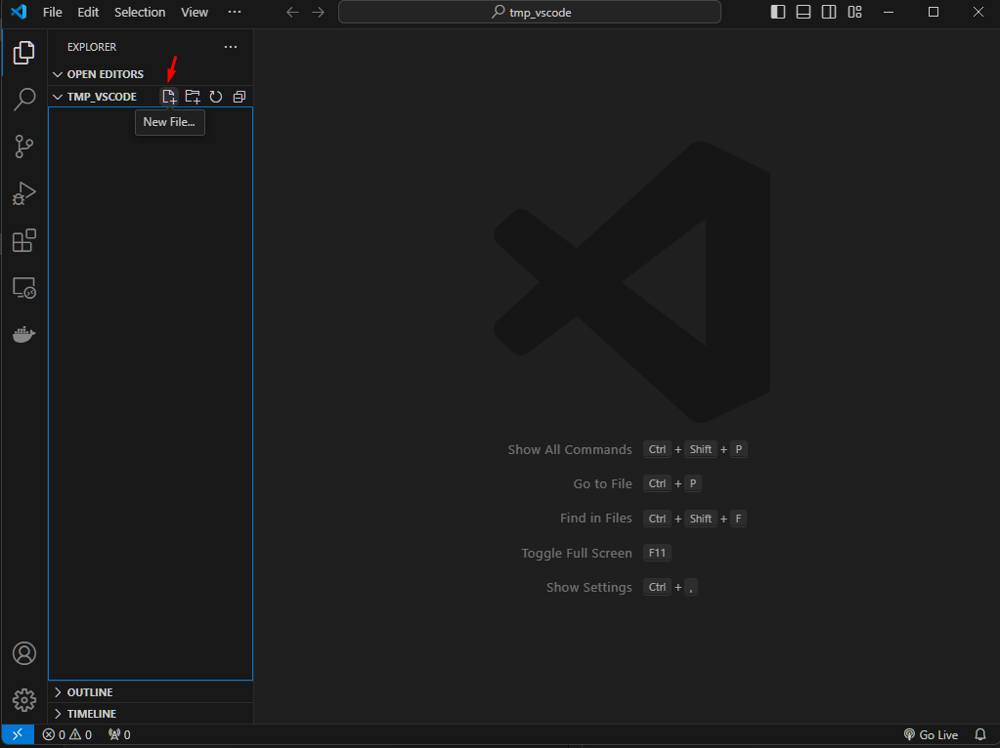

이름은 .md 를 붙이기. 그래야 markdown 파일이 됩니다.
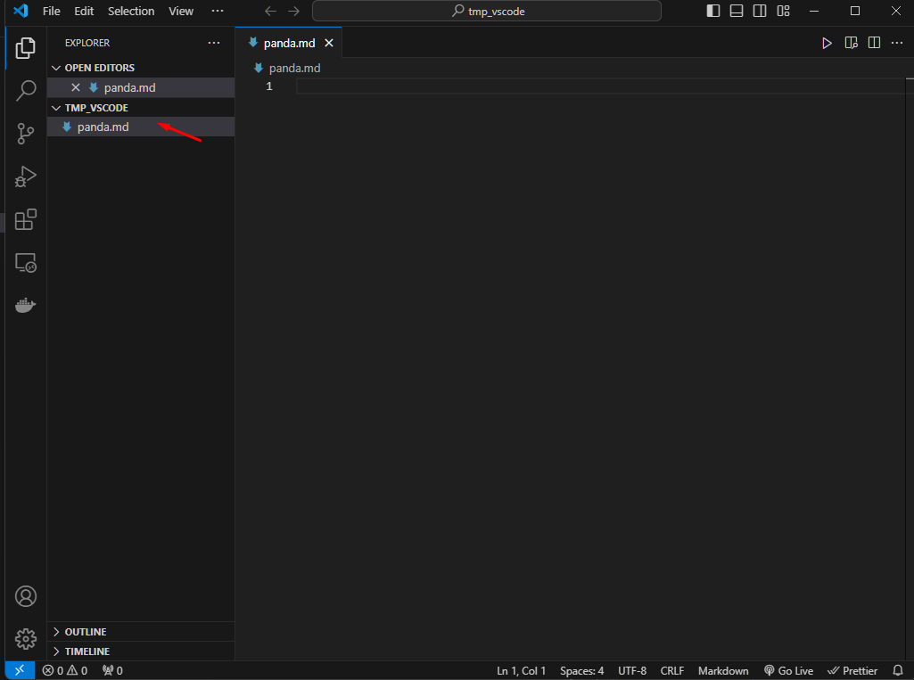

이제 파일에서 우클릭 후, Open Preview 를 클릭하거나,
Ctrl+Shift+V 를 누르면 Preview 를 열 수 있습니다.
Preview 가 뭐냐면 md 형식으로 작성한 문서가 실제로 어떻게 보이는지 변환해서 보여줍니다.
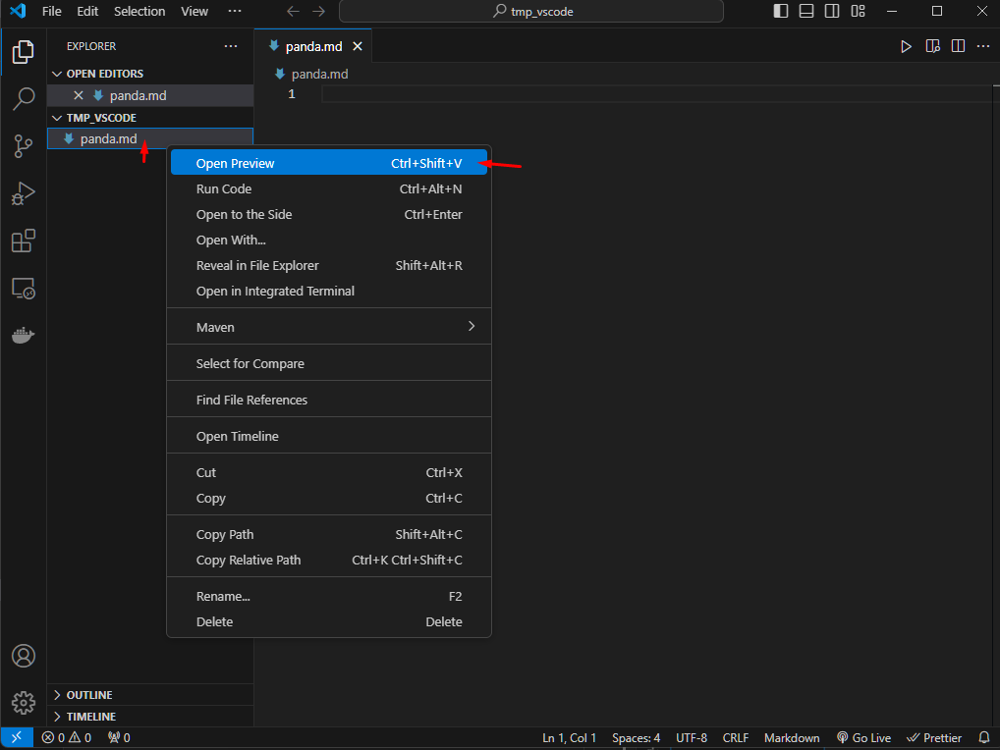

탭에 우클릭한 후, Split Left 를 누르면 더 보기 편함 ㅇㅇ
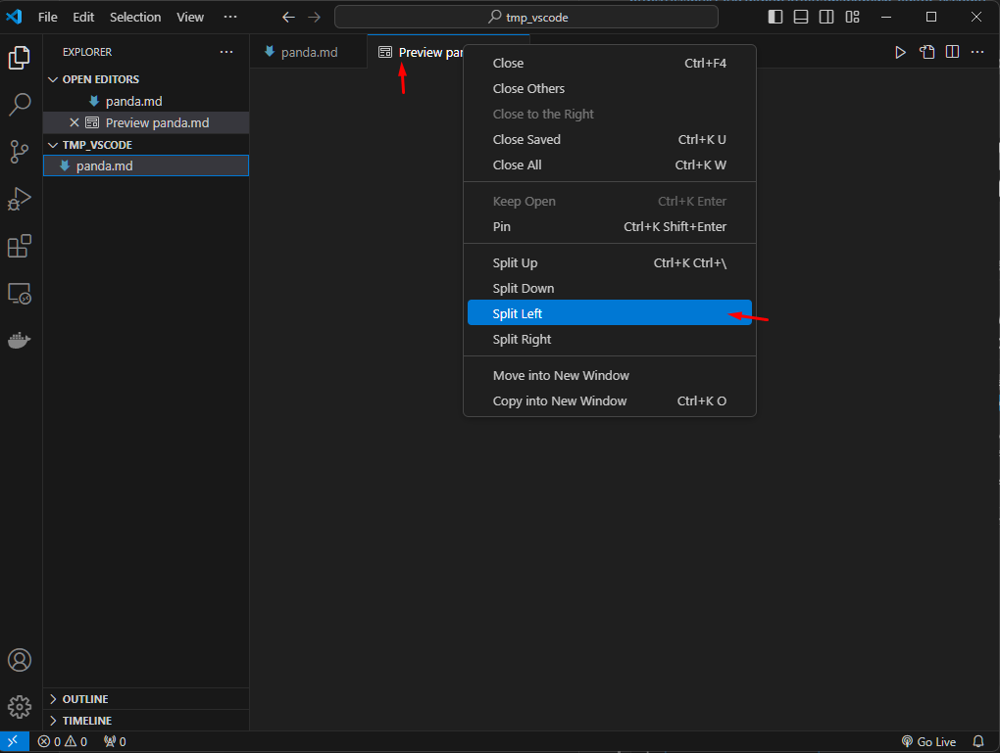

이제 markdown 문법으로 문서를 작성합니다.

- 엔터는 두번 쳐야 Preview 에서 엔터가 한번 쳐집니다.
- #을 하나 입력하고 띄어쓰기를 한번 하면 두꺼운 글씨가 입력됩니다.
- ##또는 ###을 입력하고 띄어쓰기를 한번 하고 글씨를 쓰면 #하나보다는 작은 글씨가 입력됩니다. (각각 h1,h2,h3 라고 부름)

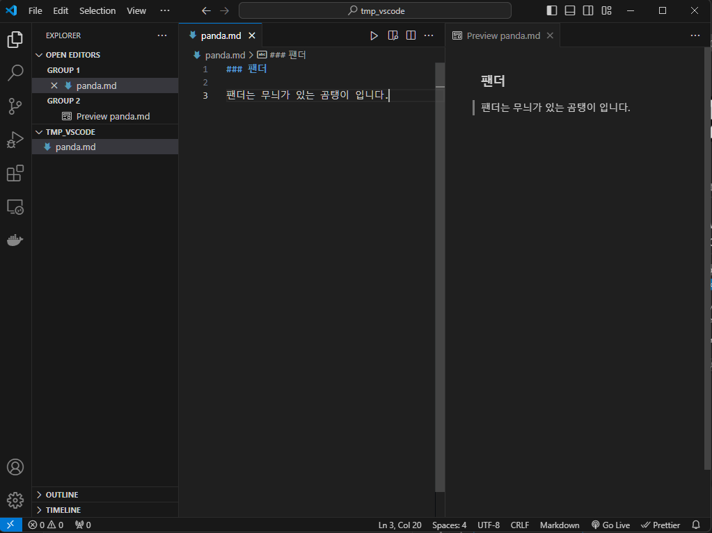

## 이미지 삽입

md 문서에 이미지를 넣을 수 있습니다.
구글에서 적당한 이미지를 복사합니다. 이미지에서 우클릭 후 복사하기 클릭

vscode 에서, 옆에 있는 탭 (정식명칭은 vscode Explorer 입니다.) 을 클릭해서 파란색 테두리가 생기도록 선택
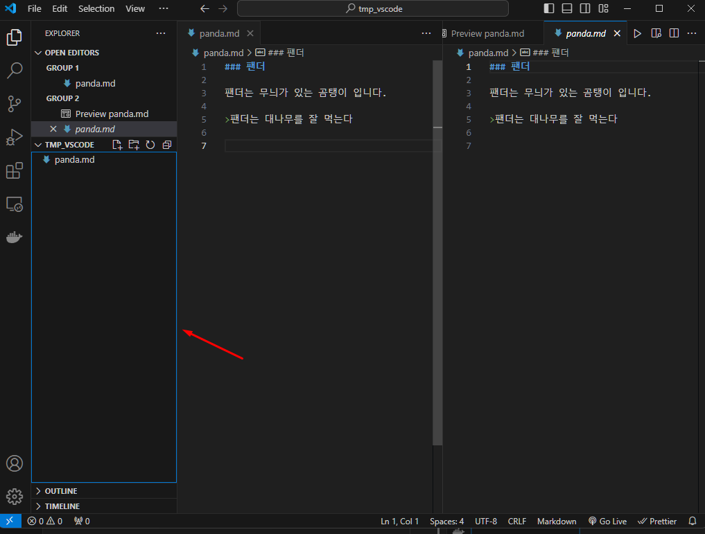

Ctrl+V 를 누르면 붙여넣어집니다. (사진을 저장한다음, 폴더로 옮겨도 됩니다. 근데 이게 편함)
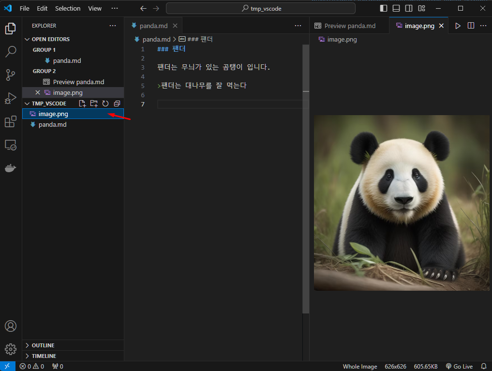

이제 이 파일을 md 문서에 삽입하려면, 
! 를 입력하고 대괄호를 입력하고 괄호를 입력하면 됩니다.

대괄호 안에는 사진 설명이 들어가고, 괄호안에는 이미지의 경로(path 라고 부릅니다)를 입력합니다.
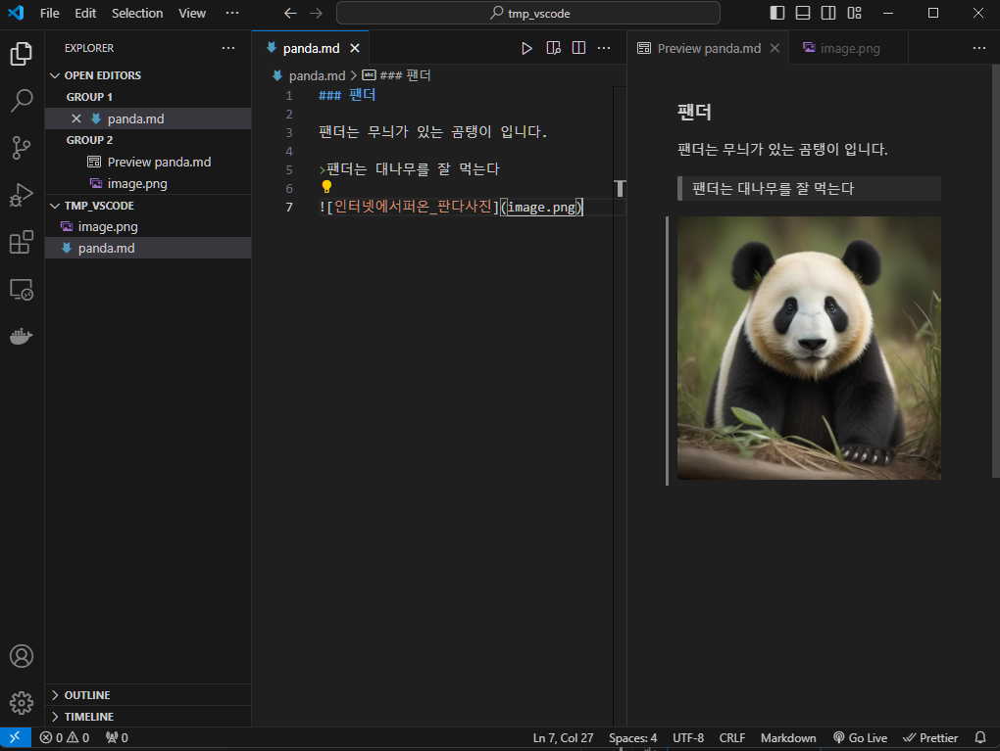

근데 파일이름이 image 면 구분하기 어려우니, 사진이 여러개면 이미지 파일이름을 바꿔놓는 것이 좋습니다. 앞에는 숫자_ 를 입력해서 보기 좋게 정렬 ㄱㄱ
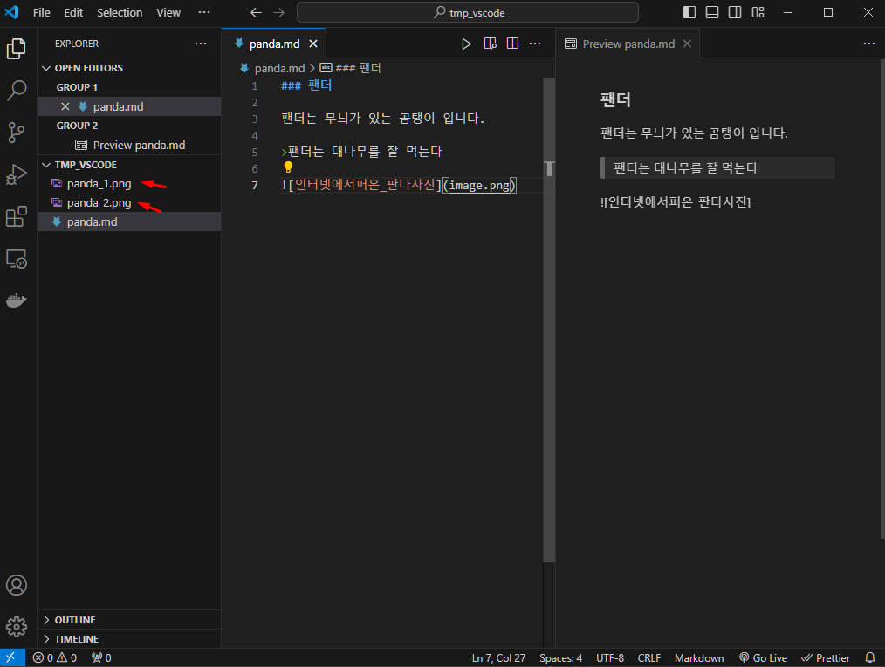

이미지나 파일이 여러개면 폴더에 넣어놓는게 좋습니다.
폴더 만들기 클릭 ㄱㄱ
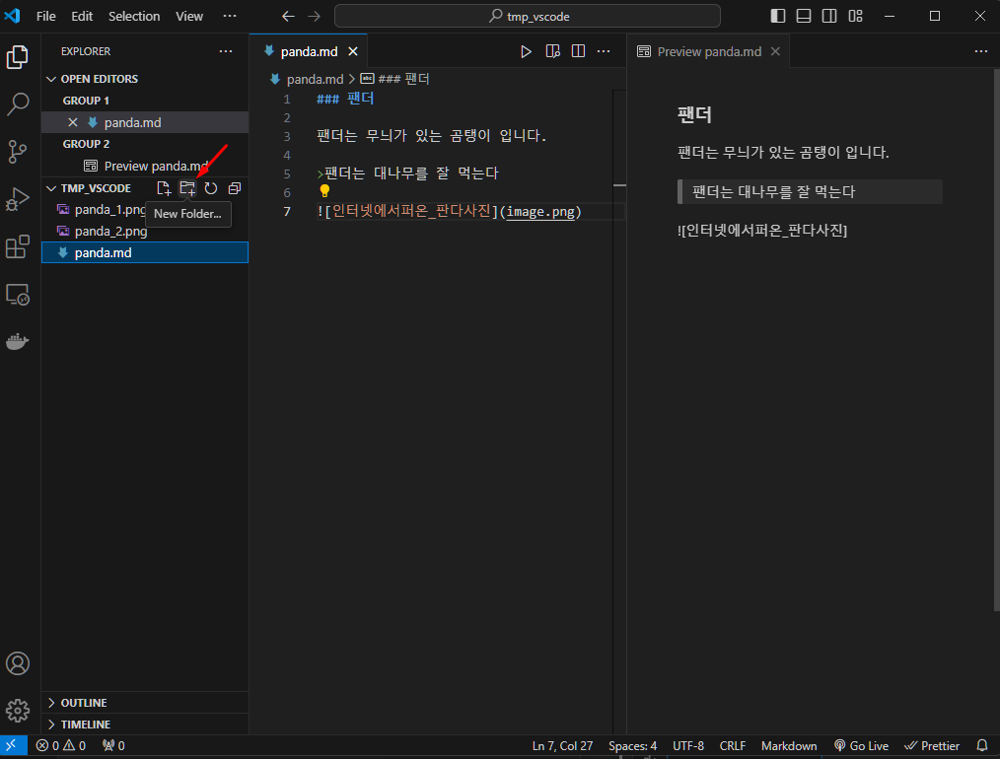

드래그해서 넣으면 됩니다.
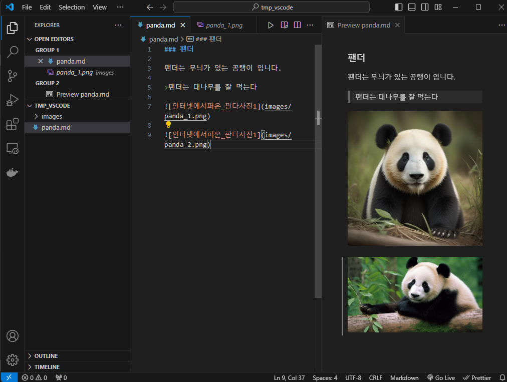

## 다른 md 파일 링크하기
문서안에 다른 문서의 하이퍼링크를 넣을 수 있습니다.
형식은 이미지에서 !만 빼면 됩니다.
대괄호와 괄호를 입력하고, 대괄호에는 표시될 링크 설명을 넣고 괄호에는 실제 파일경로(path라고 함)를 넣습니다.
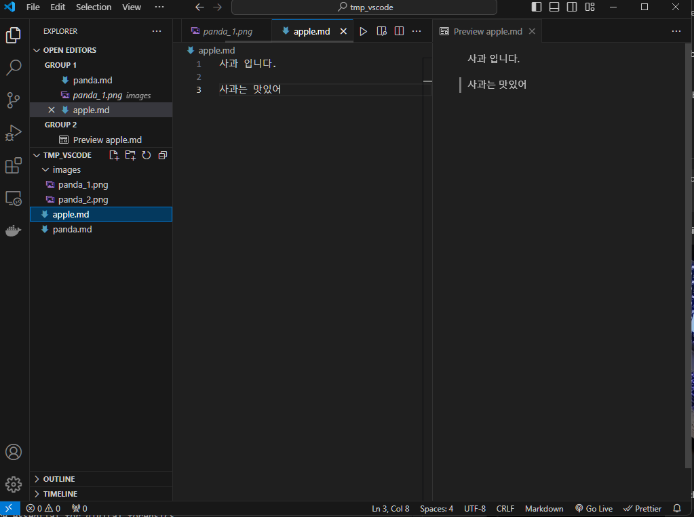 

이제 클릭하면 해당 문서로 이동됩니다.
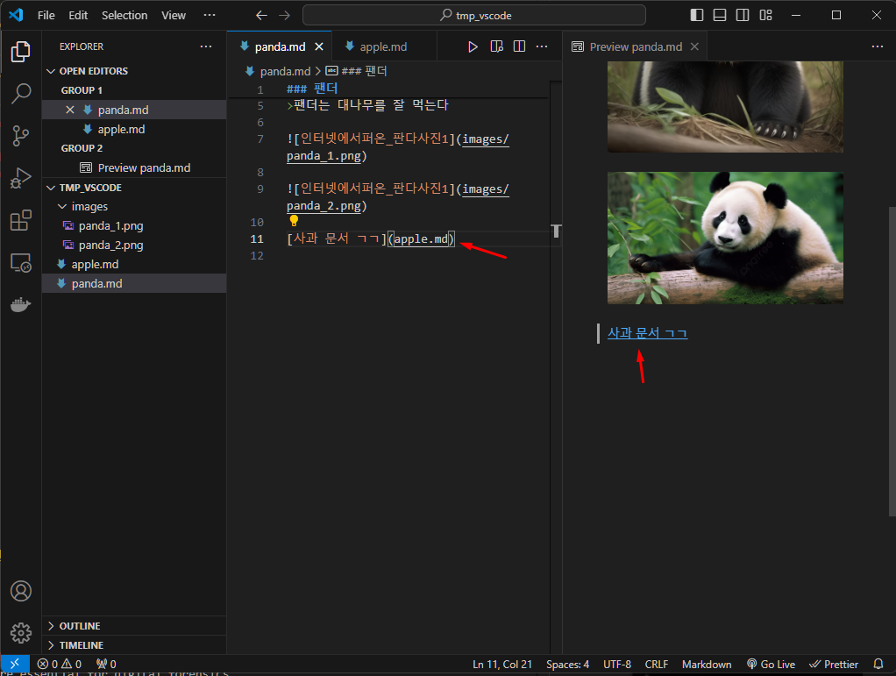