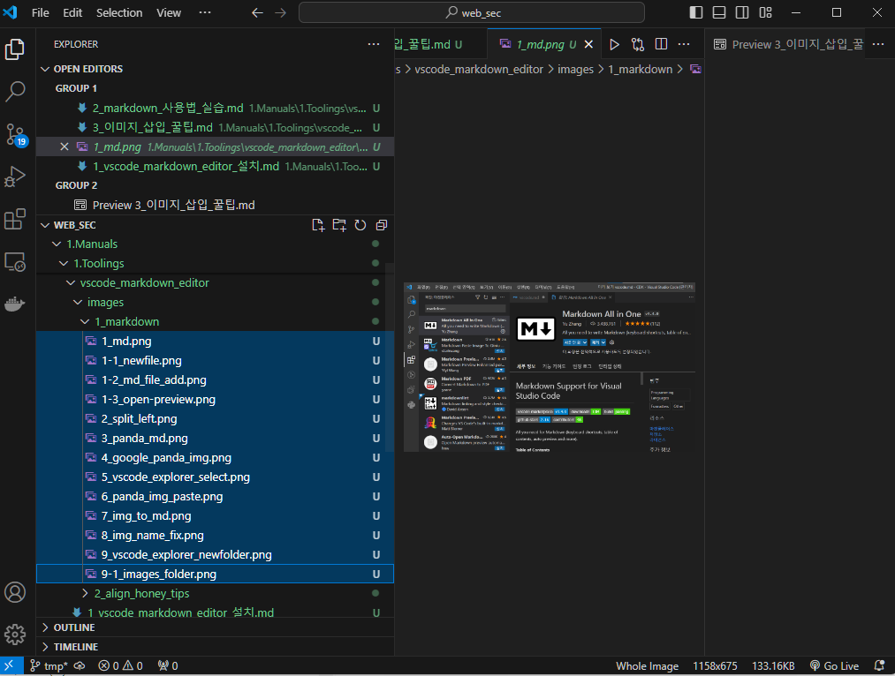
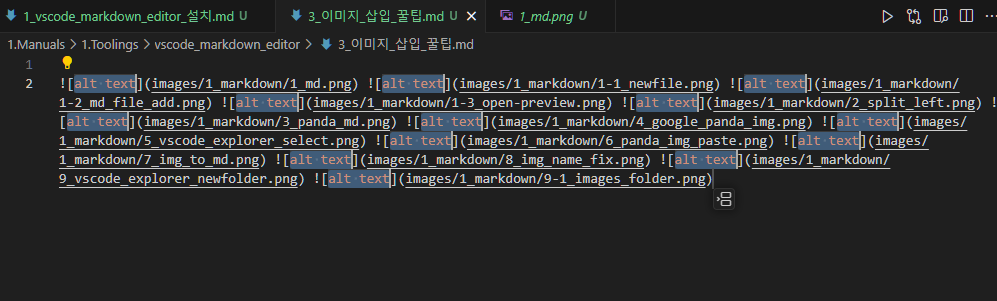
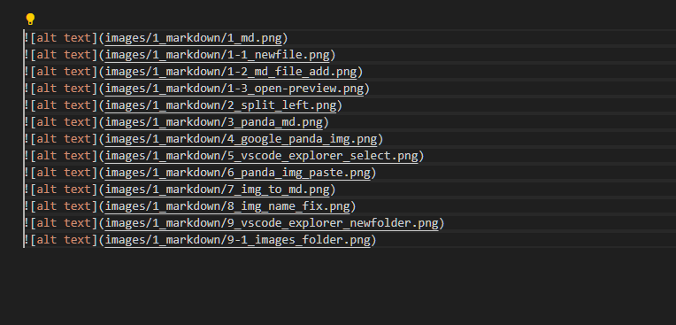

이미지가 많으면 일일이 markdown image 문법으로 입력하기가 힘든데, vscode 에서 이렇게 하면 편하다.

삽입할 이미지가 여러개일때,
shift를 누른 상태에서 삽입할 이미지1 을 클릭하고 삽입할 이미지2 를 클릭하면
이미지1 ~ 이미지2 까지 모두 선택된다. 

이 상태에서 ctrl+C 를 눌러서 복사한다
 

그다음 삽입하려고하는 md 파일에 ctrl+V 를 눌러서 복붙 ㄱㄱ

그러면 한줄로 복붙된다.
 

이 상태에서 좌측 방향키를 세번 누르고 엔터를 치면 깔끔하게 정렬된다.
