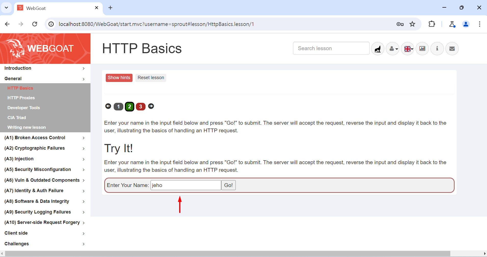
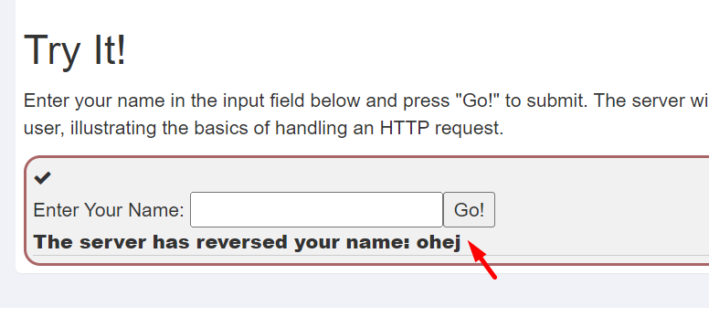
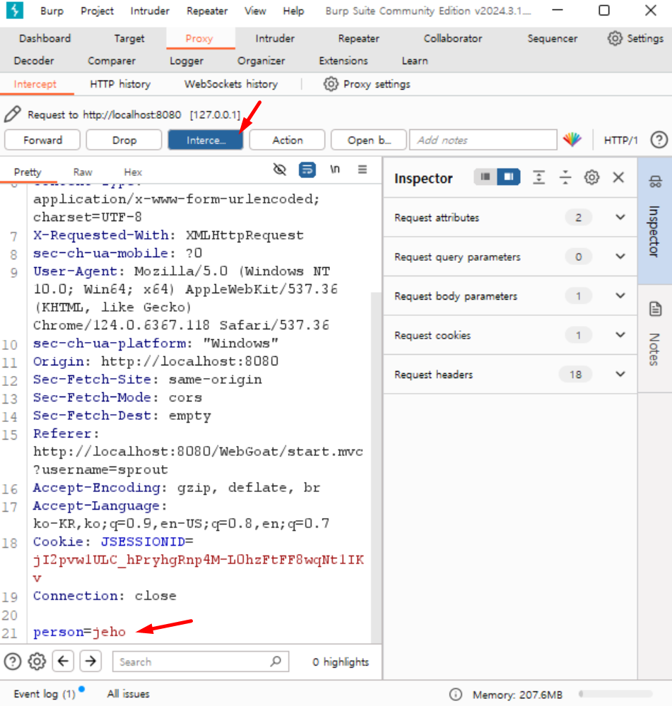
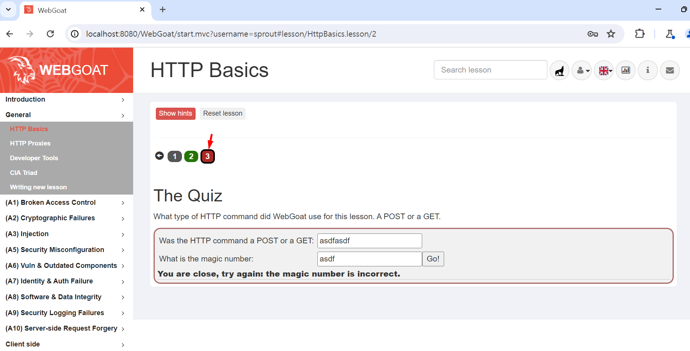
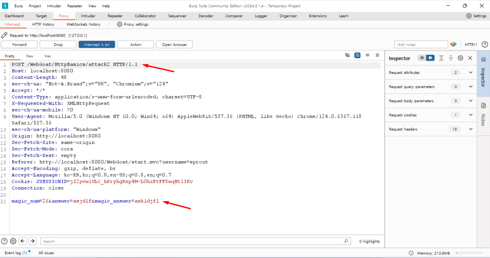
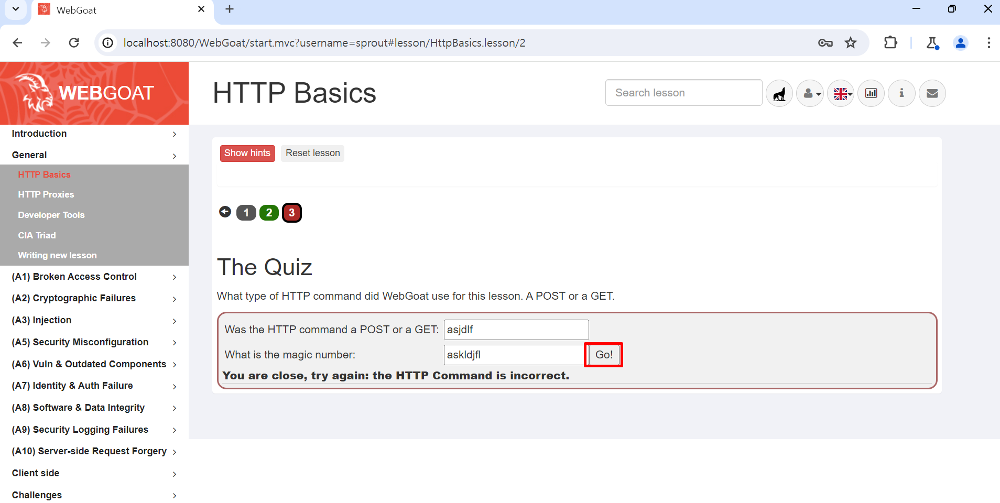
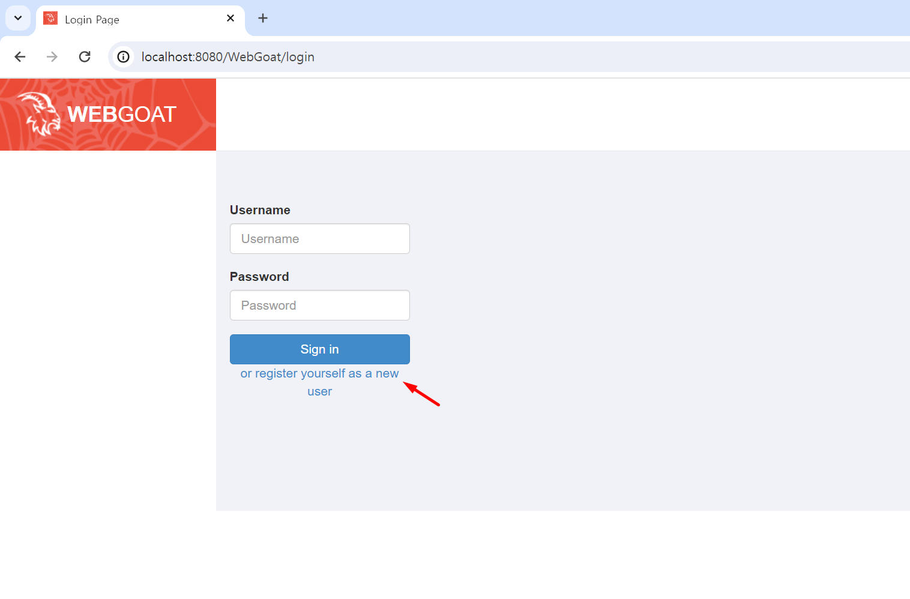
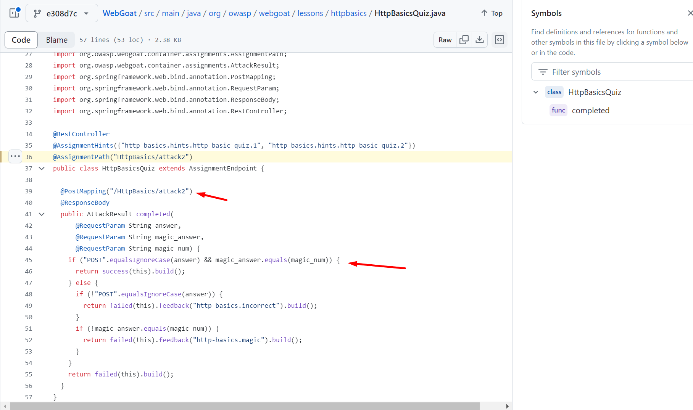

선수지식 : 
[[1-3. Burp Suite 사용법 기초 (Windows 버전)]]

HTTP Basics 를 클릭하면 요청을 전송하고 받는 간단한 시스템이 있다.

받은 요청의 문자열을 거꾸로 뒤집어서 반환한다.

패킷을 캡쳐해보면,
입력한 문자열이 intercept 된다.

### 퀴즈 풀기
퀴즈는 HTTP Basics 에서 3 버튼을 누르면 뜬다.

Go! 를 누르면 전송되는 HTTP command 의 HTTP Request 종류를 쓰고, magic number? 뭐 이게뭔진 모르겠는데 쓰면 된다고 한다.

아무거나 입력하고, Burp Suite 의 Intercept 를 켠 상태로 Go! 를 누르면,

이 패킷을 훔쳐보면 magic_num 이라는걸 프론트엔드가 생성하고 요청을 보낼때 내가 입력한 값이랑 낑겨서 보내는데 값은 26이라는걸 알 수 있다. 이게 답인가보다.

그리고 웹요청의 종류는 GET 과 POST 중 POST 이다.

근데 해보면 magic number 는 Go! 버튼을 누를때 마다 매번 바뀐다.

따라서 요청을 보낼 때 변조해서 보낸다.
answer 는 post 로, magic_answer 는 magic_number 값으로 변조한 후 보내면 된다.

그러면 성공.
단순히 패킷을 변조할 수있는지를 테스트하는 퀴즈였다.

### 참고 (여기서 부턴 안봐도 된다는 뜻)

WebGoat 는 JAVA Spring 으로 만들어졌는데 오픈소스다.

github 에 있는 WebGoat 소스코드에서 이번 실습이 어떻게 코딩되어있는지 살펴볼 수 있다.
https://github.com/WebGoat/WebGoat/blob/e308d7cde7f3c6f50016a7548f078fe481d5de8e/src/main/java/org/owasp/webgoat/lessons/httpbasics/HttpBasicsQuiz.java#L36

이번 문제의 제출은 /WebGoat/HttpBasics/attack2 엔드포인트로 요청을 보내는데, 해당 키워드로 github에 검색해보면 나온다.

java 의 equals 로 문자열을 확인하는 것을 확인할 수있다. (이걸로 정답 유무를 판별한다)

